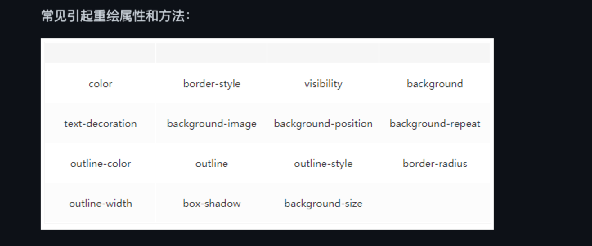

#### 1. DOCTYPE 作用
回答：
```
<!DOCTYPE>  声明一般位于文档的第一行，它的作用主要是告诉浏览器以什么样的模式来解析文档。一般指定了之后会以标准模式来
进行文档解析，否则就以兼容模式进行解析。在标准模式下，浏览器的解析规则都是按照最新的标准进行解析的。而在兼容模式下，浏
览器会以向后兼容的方式来模拟老式浏览器的行为，以保证一些老的网站的正确访问。

在 html5 之后不再需要指定 DTD 文档，因为 html5 以前的 html 文档都是基于 SGML 的，所以需要通过指定 DTD 来定义文
档中允许的属性以及一些规则。而 html5 不再基于 SGML 了，所以不再需要使用 DTD。
```

#### 2. 标准模式与兼容模式各有什么区别？
```
标准模式的渲染方式和 JS 引擎的解析方式都是以该浏览器支持的最高标准运行。在兼容模式中，页面以宽松的向后兼容的方式显示
，模拟老式浏览器的行为以防止站点无法工作。
```

#### 3. HTML5 为什么只需要写 <!DOCTYPE HTML>，而不需要引入 DTD？
```
HTML5 不基于 SGML，因此不需要对 DTD 进行引用，但是需要 DOCTYPE 来规范浏览器的行为（让浏览器按照它们应该的方式来运
行）。

而 HTML4.01 基于 SGML ，所以需要对 DTD 进行引用，才能告知浏览器文档所使用的文档类型。
```
#### 4. SGML 、 HTML 、XML 和 XHTML 的区别？
```
SGML（Standard Generalized Markup language）是标准通用置标语言，是一种定义电子文档结构和描述其内容的国际标准语言，是所有电子文档标记语言的起源。

HTML（HyperText Markup Language）是超文本标记语言，主要是用于规定怎么显示网页。

XML（Extensible Markup Language）是可扩展标记语言是未来网页语言的发展方向，XML 和 HTML 的最大区别就在于 XML 的标签是可以自己创建的，数量无限多，
而 HTML 的标签都是固定的而且数量有限。

XHTML（Extensible Hypertext Markup Language）也是现在基本上所有网页都在用的标记语言，他其实和 HTML 没什么本质的区别，标签都一样，用法也都一样，就是比 HTML 
更严格，比如标签必须都用小写，标签都必须有闭合标签等。
```
#### 5.DTD介绍
```
DTD（ Document Type Definition 文档类型定义）是一组机器可读的规则，它们定义 XML 或 HTML 的特定版本中所有允许元
素及它们的属性和层次关系的定义。在解析网页时，浏览器将使用这些规则检查页面的有效性并且采取相应的措施。

DTD 是对 HTML 文档的声明，还会影响浏览器的渲染模式（工作模式）。

三种DTD类型的作用说明：

Strict : 干净的标记，免于表现层的混乱，与层叠样式表（CSS）配合使用。
Transitional :包含 W3C 所期望移入样式表的呈现属性和元素。使用不支持层叠样式表（CSS）的浏览器时使用。
Frameset : 应当被用于带有框架的文档。除 frameset 元素取代了 body 元素之外，Frameset等同于 Transitional。

DOCTYPE标签是一种标准通用标记语言的文档类型声明，声明文档的解析类型，它的目的是要告诉标准通用标记语言解析器，它应该使用什么样的DTD（用什么样的文档标准）来解析文档。DTD定义了文档中的元素(标记和属性)和实体，以及相互关系。 通过DTD验证XML文档的有效性。DTD为解析器提供了解析HTML文档的依据。
```

#### 6. 行内元素定义
```
一个行内元素只占据它对应标签的边框所包含的空间

常见的行内元素有 a b span img strong sub sup button input label select textarea

```
#### 6. 块元素定义
```
块级元素占据其父元素（容器）的整个宽度，因此创建了一个“块”。

常见的块级元素有  div ul ol li dl dt dd h1 h2 h3 h4 h5 h6 p 

```
#### 8. 行内元素与块级元素的区别？
```
HTML4中，元素被分成两大类：inline （内联元素）与 block （块级元素）。

（1） 格式上，默认情况下，行内元素不会以新行开始，而块级元素会新起一行。
（2） 内容上，默认情况下，行内元素只能包含文本和其他行内元素。而块级元素可以包含行内元素和其他块级元素。
（3） 行内元素与块级元素属性的不同，主要是盒模型属性上：行内元素设置 width 无效，height 无效（可以设置 line-hei
     ght），设置 margin 和 padding 的上下不会对其他元素产生影响。
```

#### 9. HTML5 元素的分类
```
HTML4中，元素被分成两大类: inline（内联元素）与 block（块级元素）。但在实际的开发过程中，因为页面表现的需要，前
端工程师经常把 inline 元素的 display 值设定为 block （比如 a 标签），也经常把 block 元素的 display 值设定为
inline 之后更是出现了 inline-block 这一对外呈现 inline 对内呈现 block 的属性。因此，简单地把 HTML 元素划分为
inline 与 block 已经不再符合实际需求。

HTML5中，元素主要分为7类：Metadata Flow Sectioning Heading Phrasing Embedded Interactive
```

#### 10. 空元素定义
```
标签内没有内容的 HTML 标签被称为空元素。空元素是在开始标签中关闭的。

br hr img input link meta

```
#### 11. link 标签定义
```
link 标签定义文档与外部资源的关系。
link 元素是空元素  它仅包含属性  此元素用于head部分 不过它可出现任何次数
link 标签中的rel 属性定义当前文档与被链接文档间的关系  常见的 stylesheet 指的是定义一个外部加载的样式表
```
#### 12. 页面导入样式时，使用 link 和 @import 有什么区别？
```
1. 从属关系  @import 是css提供的语法规则  只有导入样式表    link 是html提供的标签  不仅可以加载css  还可以定义rss rel 引入图标
2. 加载顺序区别  加载页面 link 引入的css 被同时加载  @import 引入的css 等页面加载完才会加载
3. 兼容性区别  @import 是css2.1 才有的 只可在IE+5 使用   link 是html元素 没有兼容性问题
4. dom 可控制区域  可以通过js 操作dom 控制link   由于dom基于文档 无法使用@import 插入样式
```
#### 13.浏览器的理解
```
浏览器的主要功能是将用户选择的 web 资源呈现出来，它需要从服务器请求资源，并将其显示在浏览器窗口中，资源的格式通常
是 HTML，也包括 PDF、image 及其他格式。用户用 URI（Uniform Resource Identifier 统一资源标识符）来指定所请
求资源的位置。

HTML 和 CSS 规范中规定了浏览器解释 html 文档的方式，由 W3C 组织对这些规范进行维护，W3C 是负责制定 web 标准的
组织。

但是浏览器厂商纷纷开发自己的扩展，对规范的遵循并不完善，这为 web 开发者带来了严重的兼容性问题。

简单来说浏览器可以分为两部分，shell 和 内核。

其中 shell 的种类相对比较多，内核则比较少。shell 是指浏览器的外壳：例如菜单，工具栏等。主要是提供给用户界面操作，
参数设置等等。它是调用内核来实现各种功能的。内核才是浏览器的核心。内核是基于标记语言显示内容的程序或模块。也有一些
 浏览器并不区分外壳和内核。从 Mozilla 将 Gecko 独立出来后，才有了外壳和内核的明确划分。
```

#### 14.介绍一下你对浏览器内核的理解？
```
主要2部分 渲染引擎  js引擎
渲染引擎的职责就是渲染，即在浏览器窗口中显示所请求的内容。默认情况下，渲染引擎可以显示 html、xml 文档及图片，它也
可以借助插件（一种浏览器扩展）显示其他类型数据，例如使用 PDF 阅读器插件，可以显示 PDF 格式。

JS 引擎：解析和执行 javascript 来实现网页的动态效果。

最开始渲染引擎和 JS 引擎并没有区分的很明确，后来 JS 引擎越来越独立，内核就倾向于只指渲染引擎

```

#### 15.常见的浏览器内核比较
```
Trident 这种浏览器内核是 IE 浏览器用的内核，因为在早期 IE 占有大量的市场份额，所以这种内核比较流行，以前有很多
网页也是根据这个内核的标准来编写的，但是实际上这个内核对真正的网页标准支持不是很好。但是由于 IE 的高市场占有率，微
软也很长时间没有更新 Trident 内核，就导致了 Trident 内核和 W3C 标准脱节。还有就是 Trident 内核的大量 Bug 等
安全问题没有得到解决，加上一些专家学者公开自己认为 IE 浏览器不安全的观点，使很多用户开始转向其他浏览器。
Gecko  这是 Firefox 和 Flock 所采用的内核，这个内核的优点就是功能强大、丰富，可以支持很多复杂网页效果和浏览器扩
展接口，但是代价是也显而易见就是要消耗很多的资源，比如内存。
Presto：Opera 曾经采用的就是 Presto 内核，Presto 内核被称为公认的浏览网页速度最快的内核，这得益于它在开发时的
天生优势，在处理 JS 脚本等脚本语言时，会比其他的内核快3倍左右，缺点就是为了达到很快的速度而丢掉了一部分网页兼容性。

Webkit Webkit 是 Safari 采用的内核，它的优点就是网页浏览速度较快，虽然不及 Presto 但是也胜于 Gecko 和 Trid
ent，缺点是对于网页代码的容错性不高，也就是说对网页代码的兼容性较低，会使一些编写不标准的网页无法正确显示。WebKit 
前身是 KDE 小组的 KHTML 引擎，可以说 WebKit 是 KHTML 的一个开源的分支。

Blink 谷歌在 Chromium Blog 上发表博客，称将与苹果的开源浏览器核心 Webkit 分道扬镳，在 Chromium 项目中研发 B
link 渲染引擎（即浏览器核心），内置于 Chrome 浏览器之中。其实 Blink 引擎就是 Webkit 的一个分支，就像 webkit 是
KHTML 的分支一样。Blink 引擎现在是谷歌公司与 Opera Software 共同研发，上面提到过的，Opera 弃用了自己的 Presto 
内核，加入 Google 阵营，跟随谷歌一起研发 Blink。


```
#### 16.常见浏览器所用内核
```
IE Trident
Chrome  Blink
Firefox  Gecko
Safari webkit
Opera Presto -> webkit -> Blink
360 ie+chrome 双内核
搜狗、遨游、QQ 浏览器内核：Trident（兼容模式）+ Webkit（高速模式）；
百度浏览器、世界之窗内核：IE 内核；
2345浏览器内核：好像以前是 IE 内核，现在也是 IE + Chrome 双内核了；
UC 浏览器内核：这个众口不一，UC 说是他们自己研发的 U3 内核，但好像还是基于 Webkit 和 Trident ，还有说是基于火狐内核。
```

#### 17.浏览器的渲染原理？
```
 （1）首先解析收到的文档，根据文档定义构建一棵 DOM 树，DOM 树是由 DOM 元素及属性节点组成的。

 （2）然后对 CSS 进行解析，生成 CSSOM 规则树。

 （3）根据 DOM 树和 CSSOM 规则树构建渲染树。渲染树的节点被称为渲染对象，渲染对象是一个包含有颜色和大小等属性的矩
     形，渲染对象和 DOM 元素相对应，但这种对应关系不是一对一的，不可见的 DOM 元素不会被插入渲染树。还有一些 DOM 
     元素对应几个可见对象，它们一般是一些具有复杂结构的元素，无法用一个矩形来描述。

 （4）当渲染对象被创建并添加到树中，它们并没有位置和大小，所以当浏览器生成渲染树以后，就会根据渲染树来进行布局（也
     可以叫做回流）。这一阶段浏览器要做的事情是要弄清楚各个节点在页面中的确切位置和大小。通常这一行为也被称为“自动
     重排”。

 （5）布局阶段结束后是绘制阶段，遍历渲染树并调用渲染对象的 paint 方法将它们的内容显示在屏幕上，绘制使用 UI 基础组
     件。

  值得注意的是，这个过程是逐步完成的，为了更好的用户体验，渲染引擎将会尽可能早的将内容呈现到屏幕上，并不会等到所有的
  html 都解析完成之后再去构建和布局 render 树。它是解析完一部分内容就显示一部分内容，同时，可能还在通过网络下载其
  余内容。

```
#### 18.渲染过程中遇到 JS 文件怎么处理？（浏览器解析过程）
```
js的加载 解析 与执行 会阻塞文档的解析 也就是说，在构建 DOM 时，HTML 解析器若遇到了 JavaScript，那么
 它会暂停文档的解析，将控制权移交给 JavaScript 引擎，等 JavaScript 引擎运行完毕，浏览器再从中断的地方恢复继续解
 析文档。


也就是说 如果想首屏渲染的快 越不该在首屏加载js  并且建议将js放在body后面 当然并不是必须放在底部 也可以使用defer async 
```
#### 19.async defer作用及区别 （浏览器解析过程）
```
1. 脚本没有asnyc defer  浏览器会立即加载并执行 也就是说不等待后续加载的文档元素  读到就加载并执行
2. defer 属性表示延迟执行引入的js 即这段js加载时html并为停止解析 这2个过程是并行  当整个document 解析完毕在执行脚本文件
 在DOMContentLoaded 事件触发前完成  多个脚步按顺序执行
3  async 属性表示异步执行引入的js 与defer区别在于 如果已经加载好  就会开始执行 也就是它的执行会阻塞文档解析 只是它的加载过程不阻塞
 多个脚本执行顺序无法保证

```

#### 20 什么是文档预解析 （浏览器解析过程）
```
webkit 和 firefox 都做了优化 当加载js文件时   另一个线程解析剩下的文档 并加载后面需要通过网络加载的资源 这种方式可以使资源并行加载从而使整体加载速度更快  需要注意的是 与解析并不改变dom树 将这个工作留给主解析过程 自己只解析外部资源引用  比如外部脚本  样式表及图片
```
#### 21. CSS 如何阻塞文档解析？（浏览器解析过程）
```
理论上  样式表不改变dom树 也就没必要停下文档的解析等待他们 然鹅存在一个问题  js脚本执行需要时可能在文档的解析过程请求样式表信息 如果样式
还没有加载和解析  脚本得到错误信息  这会导致更多的问题

所以如果浏览器尚未完成 CSSOM 的下载和构建，而我们却想在此时运行脚本，那么浏览器将延迟 JavaScript 脚本执行和文档
的解析，直至其完成 CSSOM 的下载和构建。也就是说，在这种情况下，浏览器会先下载和构建 CSSOM，然后再执行 JavaScript，
最后再继续文档的解析。
```
#### 22.渲染页面时常见哪些不良现象？（浏览器渲染过程）
```
FOUC  flash of unstyled content 主要指的是样式闪烁的问题，由于浏览器渲染机制（比如firefox），在 CSS 加载之前，先呈现了 HTML，就会导致展示出无样式内容，然后样式突然呈现的现象。会出现这个问题的原因主要是 CSS 加载时间过长，或者 CSS 被放在了文档底
     部。

白屏  有些浏览器渲染机制（比如chrome）要先构建 DOM 树和 CSSOM 树，构建完成后再进行渲染，如果 CSS 部分放在 HTML 
      尾部，由于 CSS 未加载完成，浏览器迟迟未渲染，从而导致白屏；也可能是把 JS 文件放在头部，脚本的加载会阻塞后面
      文档内容的解析，从而页面迟迟未渲染出来，出现白屏问题。
```
#### 23.如何优化关键渲染路径？（浏览器渲染过程）
```
 为尽快完成首次渲染，我们需要最大限度减小以下三种可变因素：
1. 关键资源的数量
2. 关键路径的长度
3. 关键字节的数量
关键资源是可能阻止网页首次渲染的资源。这些资源越少，浏览器的工作量就越小，对 CPU 以及其他资源的占用也就越少。

 同样，关键路径长度受所有关键资源与其字节大小之间依赖关系图的影响：某些资源只能在上一资源处理完毕之后才能开始下载，
 并且资源越大，下载所需的往返次数就越多。

 最后，浏览器需要下载的关键字节越少，处理内容并让其出现在屏幕上的速度就越快。要减少字节数，我们可以减少资源数（将它
 们删除或设为非关键资源），此外还要压缩和优化各项资源，确保最大限度减小传送大小。

优化关键渲染路径的常规步骤如下：

 （1）对关键路径进行分析和特性描述：资源数、字节数、长度。
 （2）最大限度减少关键资源的数量：删除它们，延迟它们的下载，将它们标记为异步等。
 （3）优化关键字节数以缩短下载时间（往返次数）。
 （4）优化其余关键资源的加载顺序：您需要尽早下载所有关键资产，以缩短关键路径长度。

```

#### 24.什么是重绘和回流？（浏览器绘制过程）
```
重绘  当渲染树中的一些元素需要更改属性  而这些属性之影响元素的外观 风格 而不会影响元素的布局  比如background-color  我们将这些操作
     称之为重绘
回流  当渲染树中的一部分  因为元素的尺寸 布局 隐藏等改变而需要重新构建的操作  会影响到布局的操作  这样的操作我们称之为回流
常见引起回流的属性


任何改变元素的几何信息  都会触发回流
1 添加删除可见的dom元素
2 元素尺寸变化 - 边距  边框 填充 高度 宽度
3. 内容变化 input输入字体
4 浏览器窗口变化  resize事件发生时
5. 计算offewidth offheight熟悉 
6. 设置style属性的值
7 当修改网页默认字体

回流必定会发生重绘，重绘不一定会引发回流。回流所需的成本比重绘高的多，改变父节点里的子节点很可能会导致父节点的一系列
 回流

重绘的


```

#### 25. 如何减少回流？（浏览器绘制过程）
```
 （1）使用 transform 替代 top

 （2）不要把节点的属性值放在一个循环里当成循环里的变量

 （3）不要使用 table 布局，可能很小的一个小改动会造成整个 table 的重新布局

 （4）把 DOM 离线后修改。如：使用 documentFragment 对象在内存里操作 DOM

 （5）不要一条一条地修改 DOM 的样式。与其这样，还不如预先定义好 css 的 class，然后修改 DOM 的 className。
```
#### 26. 为什么操作 DOM 慢？（浏览器绘制过程）
```
 一些 DOM 的操作或者属性访问可能会引起页面的回流和重绘，从而引起性能上的消耗。

```

#### 27. DOMContentLoaded 事件和 Load 事件的区别？
```
当初始的 HTML 文档被完全加载和解析完成之后，DOMContentLoaded 事件被触发，而无需等待样式表、图像和
 子框架的加载完成。
 Load 是所有资源加载完触发的
```
#### 28.HTML5 有哪些新特性、移除了那些元素？
```
HTML5现在已经不是 SGML 的子集  主要是关于图像 位置 存储 多任务等功能的增加

新增的有：
绘画 canvas
用于媒介回放 video audio
本地离线存储 localstorage
sessionStorage 浏览器关闭数据就消失了
语义化更好的内容  article footer header nav  section 
表单控件 calendar date time email url search
新的技术 webworker webscoket
新的文档属性 document.visibilityState

移除的属性

纯表现  basefont  big  center font s  strike tt u 
 对可用性产生负面影响的元素：frame，frameset，noframes；


```
#### 29. 如何处理 HTML5 新标签的浏览器兼容问题？
```
1. IE8/IE7/IE6 支持通过 document.createElement 方法产生的标签，可以利用这一特性让这些浏览器
     支持 HTML5 新标签，浏览器支持新标签后，还需要添加标签默认的样式。
2. 当然也可以直接使用成熟的框架，比如 html5shiv ;
      `<!--[if lt IE 9]>
      <script> src="https://cdn.jsdelivr.net/npm/html5shiv/dist/html5shiv.min.js"</script>
      <![endif]-->`

      [if lte IE 9]……[endif] 判断 IE 的版本，限定只有 IE9 以下浏览器版本需要执行的语句。
```
#### 30. 简述下你对语义话的理解
相关知识点：

```
1. 正确的标签做正确的事
2. html 语义化让页面的内容结构化 结构更清晰  便于对浏览器 搜索引擎解析
3. 即使没有样式css的情况下 也一种文档格式显示  并且是易读的
4. 搜索引擎的爬虫也依赖于 HTML 标记来确定上下文和关键字的权重 利于seo
5. 使阅读源代码的人对网站更容易将网站分块，便于阅读维护理解。
```